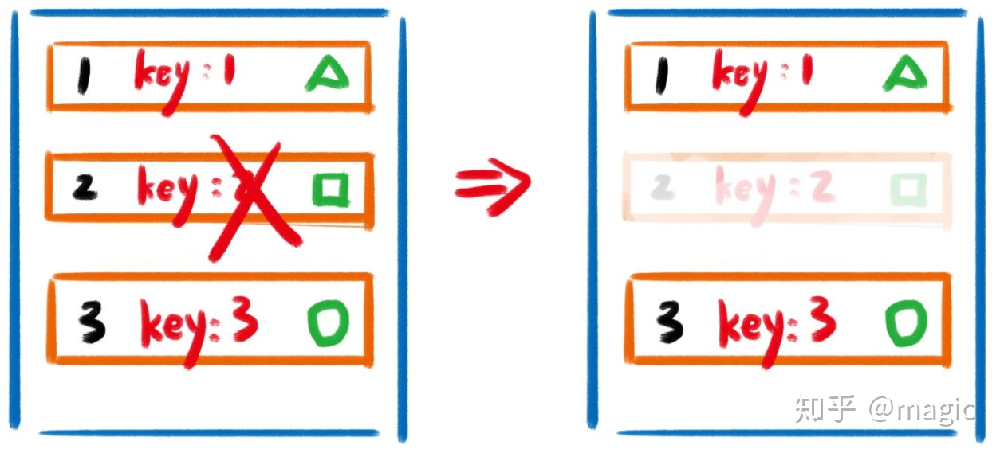

# 1.虚拟 DOM 是什么
说虚拟DOM之前先来了解一下，真实DOM极其解析流程：

浏览器的渲染原理：
* 首先根据HTML创建HTML树（DOM），根据CSS创建CSS树（CSSOM），将2棵树合并成一颗渲染树（render tree）;
* 然后浏览器开始布局Layout（文档流盒模型型，计算大小和位置），绘制Paint（把边框颜色，文字颜色，阴影等画出来），合成Compose（根据层叠关系展示画面）
* 原生JS或JQ操作DOM时，浏览器会从构建DOM树开始从头到尾执行一遍流程，频繁操作还是会出现页面卡顿，影响用户体验。
* 虚拟DOM就是为了解决浏览器性能问题而被设计出来的。
虚拟DOM就是一个能代表DOM树的对象，通常含有标签名，标签上的属性，事件监听和子元素们，以及其他属性。
# 2.虚拟 DOM 的优点
* 减少DOM操作。
虚拟DOM，可以将多次操作合并为一次操作，减少DOM操作的次数，如添加1000个节点DOM操作1000次，虚拟DOM操作1次；
* 虚拟DOM，借助DOM diff可以把多余的的操作省掉，减少DOM操作的范围，如添加1000个节点，虚拟DOMvue和react可以通过对比只操作10个次。
* 跨平台渲染。虚拟DOM不仅可以变成DOM，还可以变成小程序，IOS应用，安卓应用，因为虚拟DOM本质上只是一个，JS对象。
# 3.虚拟 DOM 的缺点
* 需要额外的创建函数来创建虚拟DOM。
* 如react,通过babel转为createElement形式；
或vue,通过vue-loader转为h形式。
* 严重依赖打包工具，添加额外构建过程。不打包JS语法不认识。

# 4.DOM diff 是什么
1. 虚拟DOM的对比算法。

通过对比发现div没变，不用更新；子元素1标签没变，children变了更新DOM；子元素2不见了，删除对应的DOM

总结DOM diff就是一个函数，称为patch。patches = patchchange(oldVNode,newVNode)，然后新老节点对比。
# 5.DOM diff 的优点
减少DOM操作的范围，如添加1000个节点，虚拟DOMvue和react可以通过对比只操作10次。
# 6.DOM diff 的问题（key）

首先对比1和1，发现1没变；然后对比2和3，发现2变成了3；最后对比unidefined和3，发现3被删除了。所以计算机的结论是，2变成了3，,3被删除了。
 ## 如何解决这个问题：用 id作为key

